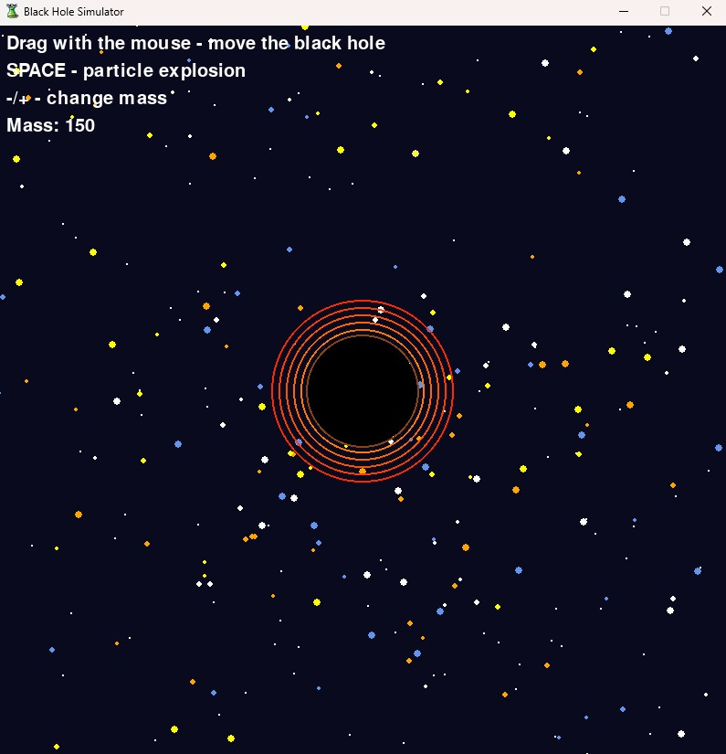
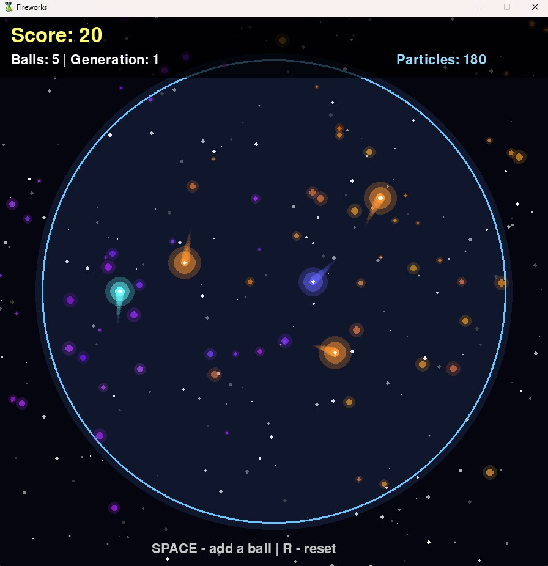

<p align="center"></p>

## Trash Projects

Trash Projects is a chaotic collection of small games and experimental apps - funny, imperfect, and made just for fun.


---

## App List

<table>
  <tr>
    <th>Number</th>
    <th>Name</th>
  </tr>
  <tr>
    <td>1.</td>
    <td>Black Hole Simulator</td>
  </tr>
  <tr>
    <td>2.</td>
    <td>Fireworks</td>
  </tr>
  <tr>
    <td>3.</td>
    <td>Flight Simulator 3D</td>
  </tr>
  <tr>
    <td>4.</td>
    <td>Fly Slap!</td>
  </tr>
  <tr>
    <td>5.</td>
    <td>Mathematical Quiz - Fuck You Edition</td>
  </tr>
</table>

---

## Installation

1. Clone the repository

```bash
git clone https://github.com/DrTrefl/TrashProjects.git
cd TrashProjects
cd src
```

2. Run the application

```bash
python [App Name].py
```

---

<p align="center"></p>

## 1. Black Hole Simulator

---

## Description

Black Hole Simulator is a game that lets you manipulate a black hole, for example by increasing or decreasing its mass, which allows it to absorb surrounding particles. The player can observe the effects of gravity in real time, experiment with different mass settings, and see how particles behave under the influence of the black hole’s immense forces.

---

## Controls

<table>
  <tr>
    <th>Key</th>
    <th>Description</th>
  </tr>
  <tr>
    <td>Mouse</td>
    <td>Move the black hole</td>
  </tr>
  <tr>
    <td>Space</td>
    <td>Particle explosion</td>
  </tr>
  <tr>
    <td>-/+</td>
    <td>Change mass</td>
  </tr>
</table>

---

## Screenshots

<p align="center"></p>

---

<p align="center"></p>

## 2. Fireworks

---

## Description

Fireworks, nothing more and nothing less.

---

## Controls

<table>
  <tr>
    <th>Key</th>
    <th>Description</th>
  </tr>
  <tr>
    <td>Space</td>
    <td>Add a ball</td>
  </tr>
  <tr>
    <td>R</td>
    <td>Reset</td>
  </tr>
</table>

---

## Screenshots

<p align="center"></p>

---

<p align="center"></p>

## 3. Flight Simulator 3D

---

## Description

Flight Simulator 3D is a realistic simulation game where you can take the controls of an aircraft and feel like a real pilot.

---

## Controls

<table>
  <tr>
    <th>Key</th>
    <th>Description</th>
  </tr>
  <tr>
    <td>Arrows</td>
    <td>Control the airplane</td>
  </tr>
  <tr>
    <td>W/S</td>
    <td>Throttle</td>
  </tr>
  <tr>
    <td>ESC</td>
    <td>Exit</td>
  </tr>
</table>

---

## Screenshots

<p align="center"></p>

---

<p align="center"></p>

## 4. Fly Slap!

---

## Description

Fly Slap! is a fast and fun arcade game where your task is to hunt down pesky flies. Use your fly swatter to hit the insects, score points, and beat your own records. Simple rules, dynamic gameplay, and plenty of satisfaction with every successful hit!

---

## Controls

<table>
  <tr>
    <th>Key</th>
    <th>Description</th>
  </tr>
  <tr>
    <td>Mouse</td>
    <td>Moving a fly swatter</td>
  </tr>
  <tr>
    <td>LMB</td>
    <td>Attack</td>
  </tr>
  <tr>
    <td>R</td>
    <td>Play again</td>
  </tr>
  <tr>
    <td>ESC</td>
    <td>Exit</td>
  </tr>
</table>

---

## Screenshots

<p align="center"></p>

---

<p align="center"></p>

## 5. Mathematical Quiz - Fuck You Edition

---

## Description

Mathematical Quiz - Fuck You Edition is a wild, no-holds-barred math quiz that doesn’t forgive mistakes! Test your knowledge, race against the clock. It's all loser!

---

## Controls

<table>
  <tr>
    <th>Key</th>
    <th>Description</th>
  </tr>
  <tr>
    <td>1 2 3 4 5 6 7 8 9 0</td>
    <td>You just type them lol</td>
  </tr>
  <tr>
    <td>-</td>
    <td>You write it when the answer requires it, it's not difficult</td>
  </tr>
  <tr>
    <td>Enter</td>
    <td>Answer confirmation</td>
  </tr>
  <tr>
    <td>ESC</td>
    <td>Exit</td>
  </tr>
</table>

---

## Screenshots

<p align="center"></p>

---

Thank you for your interest in my projects.
